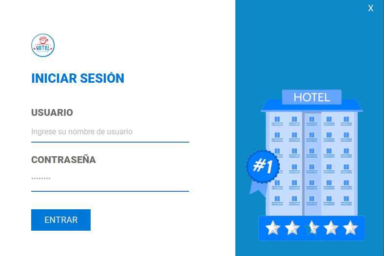
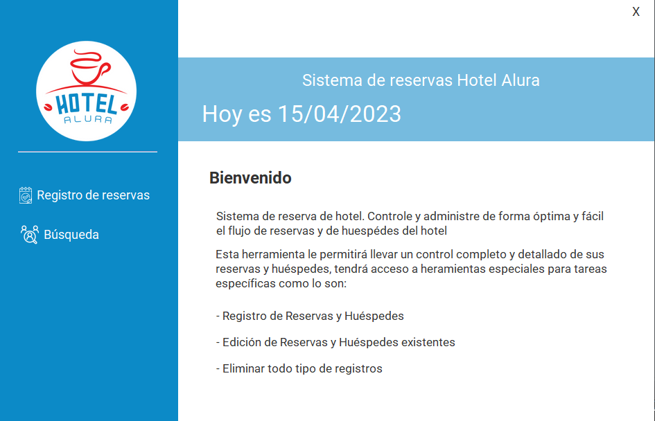
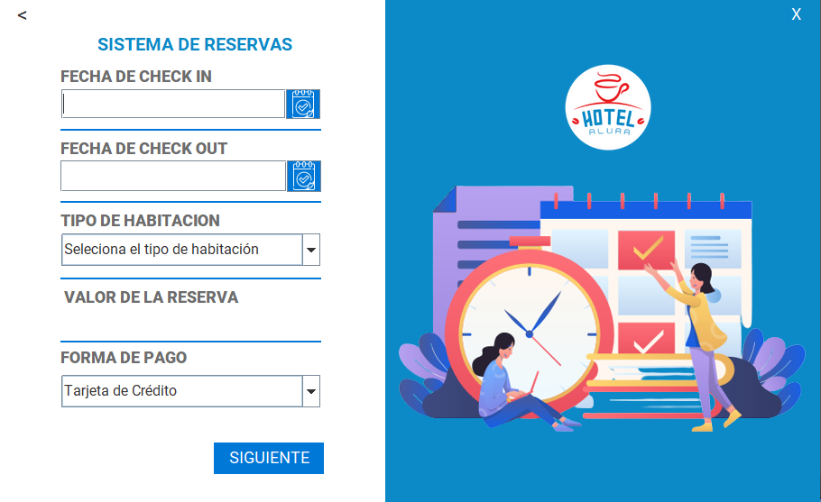

# Challenge Hotel Alura Oracle Next Education G4

## Tencnologías utilizadas

1. Java
2. JDBC
3. MySql
4. Biblioteca JCalendar
5. Plugin WindowBuilder
6. Eclipse

## Resumen

Este proyecto esta enfocado al uso de Java y JDBC para la inclusión de una base de datos creada con MySql, dentro 
de la aplicación de escritorio se han establecido diferentes funcionalidades para poder administrar un sistema de 
reservas y huespedes.

# Funcionalidades

## 1. Login

Por el momento el sistema de login hace un llamado a la base de datos preguntando si la información de usuario y contraseña
ingresados en el formulario se encuentran ingresadas en la respectiva tabla llamada user.

## 2. Menú principal

Esta ventana permite el acceso a las principales funciones que el software permite realizar detallando cada una de ellas,
ademas de especificar la fecha del sistema en la que se esta ejecutando.

## 3. Registro de reservas

Esta ventana permite a los usuarios registrar una reserva donde se identifican los campos de fecha de entrara, fecha de salida,
tipo de habitación, valor de la reserva y forma de pago, cabe destacar las respectivas validaciones donde la fecha de salida no 
puede ser previa a la fecha de entrada, los campos no pueden estar vacíos, adicionalmente se menciona que el valor de la reserva
se calcula con dos parametros que son: el numero de días y el tipo de habitación que se seleccionen.

Como regla de negocio se estableció que el valor por noche se determina de la siguiente manera:
  * Habitación Normal -> $12.99
  * Habitación Premium -> $14.99
  * Suite -> $16.99

