# Challenge Hotel Alura Oracle Next Education G4

## Tencnologías utilizadas

1. Java
2. JDBC
3. MySql
4. Biblioteca JCalendar
5. Plugin WindowBuilder
6. Eclipse

## Resumen

Este proyecto esta enfocado al uso de Java y JDBC para la inclusión de una base de datos creada con MySql, dentro 
de la aplicación de escritorio se han establecido diferentes funcionalidades para poder administrar un sistema de 
reservas y huespedes.

# Funcionalidades

## 1. Login

Por el momento el sistema de login hace un llamado a la base de datos preguntando si la información de usuario y contraseña
ingresados en el formulario se encuentran ingresadas en la respectiva tabla llamada user.

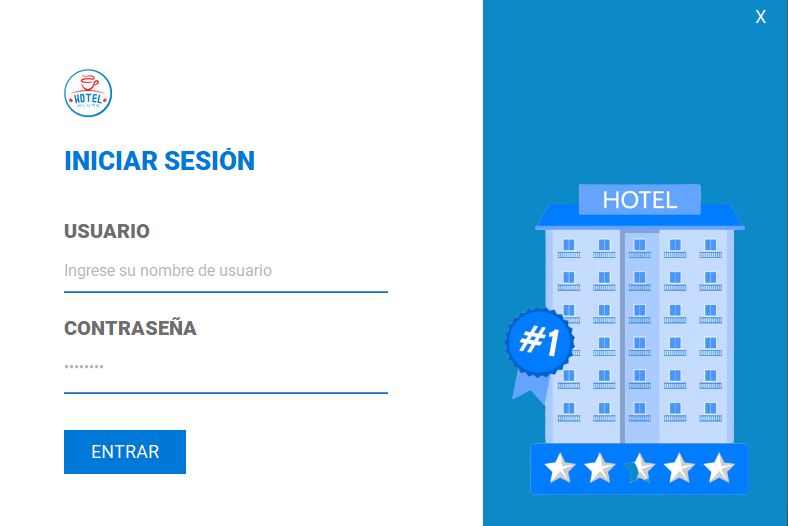

## 2. Menú principal

Esta ventana permite el acceso a las principales funciones que el software permite realizar detallando cada una de ellas,
ademas de especificar la fecha del sistema en la que se esta ejecutando.

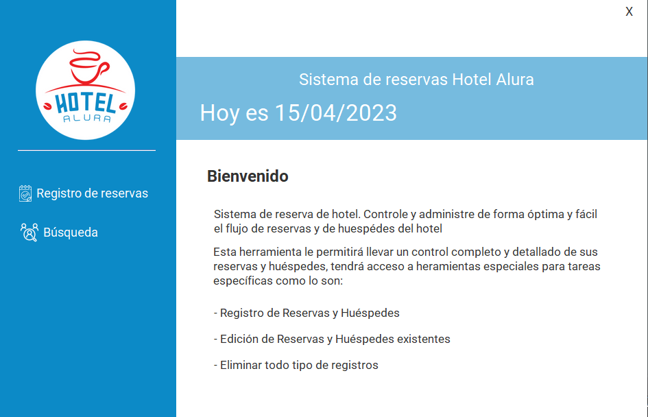

## 3. Registro de reservas

Esta ventana permite a los usuarios registrar una reserva donde se identifican los campos de fecha de entrara, fecha de salida,
tipo de habitación, valor de la reserva y forma de pago, cabe destacar las respectivas validaciones donde la fecha de salida no 
puede ser previa a la fecha de entrada, los campos no pueden estar vacíos, adicionalmente se menciona que el valor de la reserva
se calcula con dos parametros que son: el numero de días y el tipo de habitación que se seleccionen.

Como regla de negocio se estableció que el valor por noche se determina de la siguiente manera:
  * Habitación Normal -> $12.99
  * Habitación Premium -> $14.99
  * Suite -> $16.99

Finalmente al dar clic en el botón siguiente se realiza el proceso de guardado de la información en la tabla de reserva dentro 
de la base de datos.

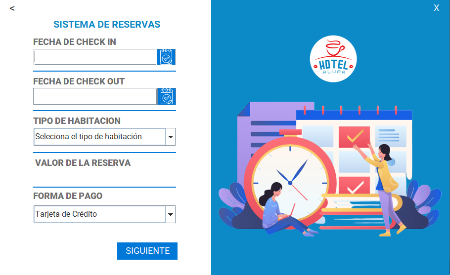

## 3. Registro Huespedes

Esta ventana permite a los usuarios que realizaron una reserva, ingresar sus datos de identificación como: nombre, apellido, 
fecha de nacimiento, nacionalidad y el numero de reserva que se asigna automaticamente tomando la reserva que hizo en el punto
anterior, se debe mencionar que en este formulario de igual manera se han añadido las validaciones de evitar campos en blanco y
de tipos de datos.

Al dar clic en el boton guardar se genera un nuevo registro en la base de datos con la información del cliente ingresada, donde 
el numero de reserva es Clave foranea de la tabla de reserva.

## 4. Sistema de Busqueda

En esta ventana se pueden observar todos los registros que están ingresados en la base de datos en sus respectivas tablas como se
puede ver a continuación:

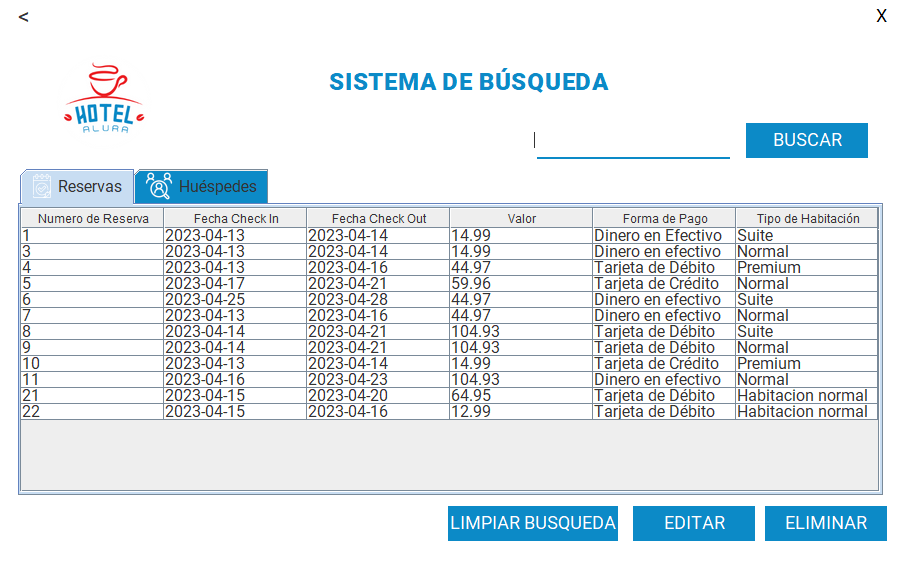 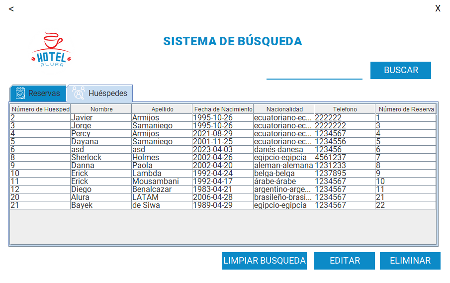

También dentro de este sistema se pueden realizar busquedas por dos parametros que son:
 * Id de reserva
 * Apellido del huésped

### Busqueda por id de reserva

  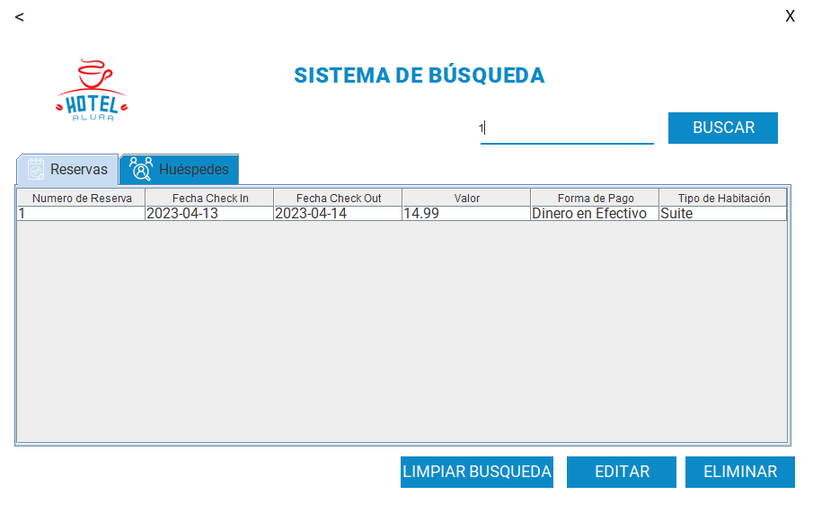

### Busqueda por apellido de huesped

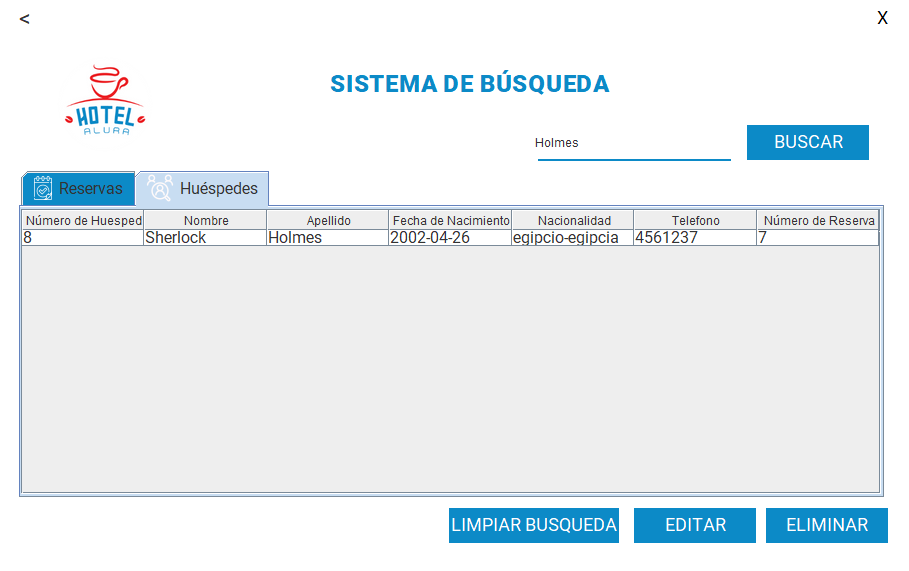  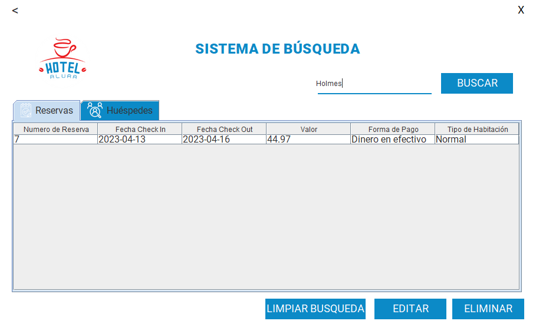

Adicionalmente, se puede realizar la edicion de los campos de la tabla desplegada de los huespedes y de las reservas, donde también 
cuentan con la validación para no dejar campos en blanco y para no repetir los id's de huéspedes y reservas.

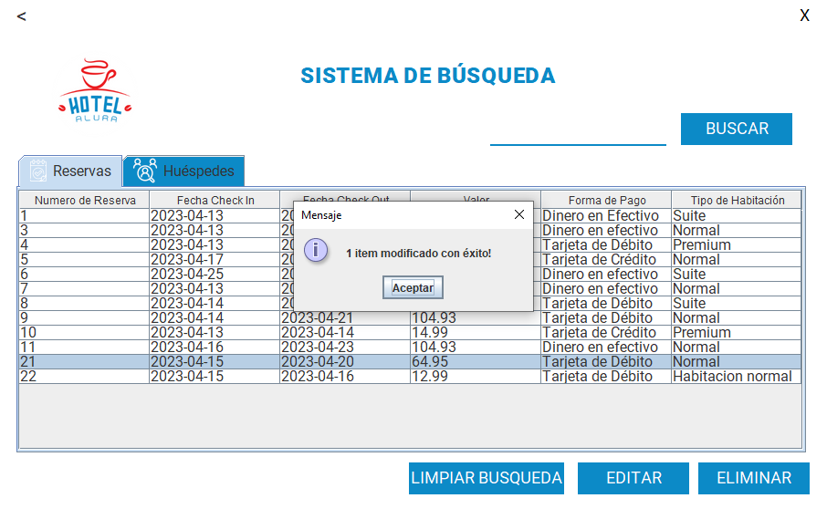

Finalmente, al seleccionar un registro de la tabla de reservas o huéspedes y presionar el botón de eliminar se retira de la tabla de la view
y también de la base de datos.

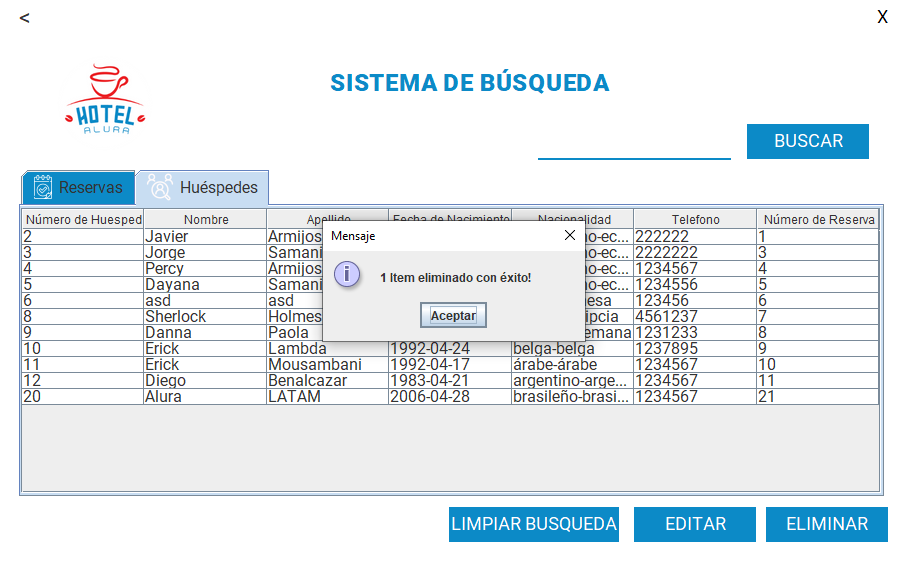

## Video Funcionamiento

Link Video en Youtube: https://youtu.be/lS8Jsyocg8Q

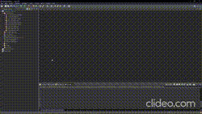

## Autor

